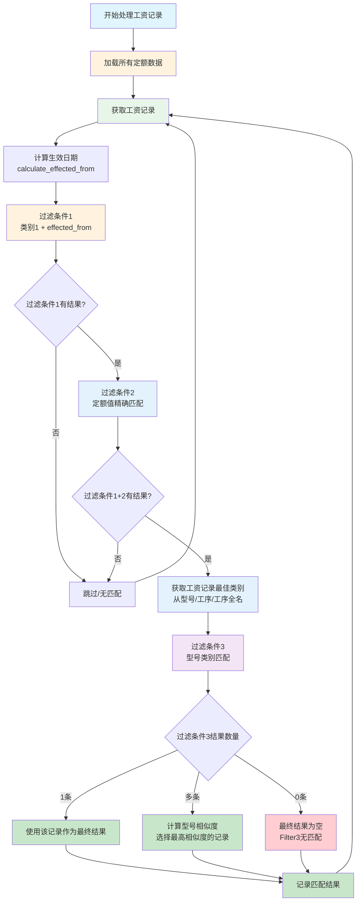
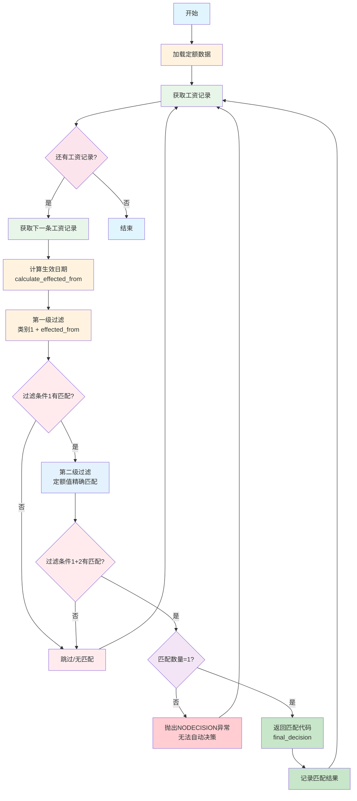

# 工资匹配系统 (Payroll Matching System)

## 系统概述

这是一个用于匹配工资记录与定额数据的自动化系统。系统从SQLite数据库中读取工资记录和定额数据，根据类别映射关系和生效日期进行智能匹配，支持交互式和批量处理两种模式。

## 系统架构

### 核心模块

1. **payroll_generator.py** - 工资记录生成器
   - `payroll_records_gen(file_name_prefix=None, sheet_name=None)` - 生成器函数，逐个生成工资记录
   - 连接实际数据库，使用SQL模板查询工资详情
   - 支持按文件名前缀和工作表名过滤记录
   - 格式化显示工资记录详细信息
   - 当不提供参数时，返回所有工资记录

2. **query_quota_table.py** - 定额数据查询器
   - `query_quota_table()` - 查询定额表并返回字典列表
   - 从数据库获取所有定额记录
   - 返回包含完整字段信息的定额数据

3. **match.py** - 工资与定额匹配程序（交互式模式）
   - 调用定额查询和工资生成器
   - 实现两级过滤逻辑：
     - 过滤条件1：基于类别映射和生效日期
     - 过滤条件2：基于定额值精确匹配
   - 提供用户交互界面选择操作
   - 显示详细的过滤条件信息
   - 以表格形式展示匹配的定额记录
   - 支持命令行参数指定文件名前缀和工作表名

4. **batch_matching.py** - 批量匹配程序（非交互式模式）
   - 非交互式批量处理工资记录
   - 自动跳过定额为0的记录
   - 调用 `final_decision` 函数进行自动决策
   - 提供处理进度跟踪和统计摘要
   - 目前限制处理前100条记录（临时限制）

5. **config.py** - 系统配置文件
   - 数据库路径配置
   - 类别映射关系定义
   - `calculate_effected_from(file_name, sheet_name)` - 智能计算生效日期
     - 根据文件名提取年月信息（支持 YYYYMM.xls, YYYYMM_x.xls 等格式）
     - 基于类别映射选择最合适的生效日期
     - 返回最接近但不大于目标日期的生效日期
   - 路径配置和常量定义

### 测试和诊断模块

6. **test_calculate_effected_from.py** - 自动化测试程序
   - 全面测试 `calculate_effected_from` 函数
   - 包含11个测试用例和边界情况测试
   - 验证不同年份、月份和工作表组合的正确性

7. **interactive_test_calculate_effected_from.py** - 交互式测试程序
   - 允许用户输入文件名和工作表名进行测试
   - 支持单个用例测试和批量测试模式
   - 显示可用工作表名称和生效日期

8. **check_table.py** - 数据库表结构检查器
   - 检查工资详情表的结构
   - 显示表字段信息和示例数据
   - 验证数据库连接和表结构

9. **check_quota_table.py** - 定额表结构检查器
   - 检查定额表的结构
   - 显示表字段信息和示例数据
   - 验证定额数据的可用性

### 辅助文件

10. **daily_log.md** - 开发日志
    - 记录系统开发进度和功能变更
    - 跟踪已完成工作和待办事项

## 核心功能

### 三级过滤逻辑

系统采用三级过滤机制逐层筛选匹配的定额记录：

### 过滤条件1 - 类别与生效日期匹配

**目的**：根据类别和生效日期筛选定额记录

**逻辑** ([`filter_quota_data()`](match.py:16))：
```python
# quota_data['类别1'] 在有效类别列表中 AND quota_data['effected_from'] == 计算的生效日期
```

**条件**：
- `类别1` 必须在该工作表名和生效日期对应的有效类别列表中
- `effected_from` 必须与计算的生效日期匹配

**示例**：
- 如果工作表名为 "精加工"，生效日期为 "20200301"
- 则只保留 `类别1` 为 ["机座", "端盖", "轴", "转子"] 的定额记录

---

### 过滤条件2 - 定额值精确匹配

**目的**：在过滤条件1的结果中，精确匹配定额值

**逻辑** ([`filter_quota_data()`](match.py:53))：
```python
# quota_data['定额'] == payroll_record['定额']
```

**条件**：`定额` 必须与工资记录的定额值完全相等

---

### 过滤条件3 - 型号类别匹配

**目的**：匹配工资记录与定额记录的型号类别

**逻辑** ([`batch_matching.py`](batch_matching.py:302))：
- 从工资记录的多个字段（`型号`、`工序`、`工序全名`）中选择相似度最高的类别作为最佳类别
- 对每条过滤条件2的结果，将其 `型号` 映射到类别
- 只保留类别与工资记录最佳类别匹配的定额记录

**详细步骤**：
1. 使用 `model_mapper` 将工资记录的 `型号`/`工序`/`工序全名` 映射到类别
2. 选择相似度最高的结果作为最佳类别
3. 对过滤条件2的每条记录，将其 `型号` 映射到类别
4. 保留类别与最佳类别匹配的记录

---

### 最终结果选择

**目的**：从过滤条件3的结果中选择最终匹配的定额记录

**规则** ([`batch_matching.py`](batch_matching.py:340))：

| 情况 | 处理方式 |
|------|----------|
| **只有1条匹配** | 直接使用该记录 |
| **多条匹配** | 计算工资 `型号` 与定额 `型号` 的字符串相似度，选择相似度最高的记录 |
| **无匹配** | 最终结果为空，标记为 "Filter3无匹配" |

---

### 过滤逻辑流程图



---

### 过滤逻辑总结表

| 过滤阶段 | 输入数据 | 匹配条件 | 输出结果 |
|----------|----------|----------|----------|
| **过滤条件1** | 所有定额数据 | `类别1` 在有效类别列表中 AND `effected_from` 匹配 | 符合类别和日期的记录 |
| **过滤条件2** | 过滤条件1结果 | `定额` 等于工资记录的 `定额` | 符合定额值的记录 |
| **过滤条件3** | 过滤条件2结果 | 定额 `型号` 的类别匹配工资记录的最佳类别 | 符合型号类别的记录 |
| **最终结果** | 过滤条件3结果 | 1条=直接使用; 多条=最高相似度; 0条=无匹配 | 单条最终记录 |

---

## 智能生效日期计算

`calculate_effected_from` 函数能够：
- 从文件名中提取年月信息（支持多种文件格式）
- 根据类别映射选择最合适的生效日期
- 处理边界情况和错误输入
- 返回最接近但不大于目标日期的生效日期

### 两级过滤逻辑

1. **第一级过滤**：基于类别映射和生效日期
   - 根据工资记录的工作表名和计算出的生效日期
   - 筛选出符合条件的定额记录类别

2. **第二级过滤**：基于定额值匹配
   - 在第一级过滤结果中精确匹配定额值
   - 返回完全匹配的定额记录

### 自动决策机制

- `final_decision` 函数根据过滤结果自动返回匹配代码
- 当只有一个匹配记录时返回代码，否则抛出 `NODECISION` 异常
- 支持批量处理中的自动化决策

## 类别映射配置

系统支持以下类别映射关系：

```python
category_mapping = {
    "精加工": { 
        "19000101": ["机座", "端盖", "轴转子", "加长轴转子加工"], 
        "20200301": ["机座", "端盖", "轴", "转子"],
    },
    "喷漆装配": {
        "19000101": ["装配", "装配铁", "同步电机"], 
        "20200301": ["装配", "特殊电机装配"],
    },
    "绕嵌排": { 
        "19000101": ["绕嵌排"], 
        "20150901": ["绕嵌排"], 
        "20161101": ["绕嵌排"], 
        "20200301": ["绕嵌排"], 
        "20201201": ["绕嵌排"], 
        "20210101": ["绕嵌排"], 
        "20211001": ["绕嵌排"], 
        "20211201": ["绕嵌排"], 
    }
}
```

## 使用方法

### 交互式匹配模式

```bash
# 处理指定文件名前缀的所有记录
python match.py 202005

# 处理指定文件名前缀和工作表名的记录
python match.py 202005 精加工
```

### 批量处理模式

```bash
# 批量处理所有工资记录（目前限制前100条）
python batch_matching.py
```

### 测试和诊断

```bash
# 运行自动化测试
python test_calculate_effected_from.py

# 运行交互式测试
python interactive_test_calculate_effected_from.py

# 检查数据库表结构
python check_table.py
python check_quota_table.py
```

## 数据流程



### 流程说明

1. **数据加载**：从定额数据库查询所有定额记录
2. **记录获取**：从工资数据库逐条获取工资记录
3. **生效日期计算**：根据文件名和工作表名计算适用的生效日期
4. **第一级过滤**：基于类别映射关系，筛选符合条件的定额记录类别
5. **第二级过滤**：在第一级过滤结果中精确匹配定额值
6. **决策处理**：
   - 如果只有一条匹配记录，返回代码
   - 如果没有或有多条匹配记录，抛出异常或跳过

## 系统特点

- **灵活性**：支持交互式和批量两种处理模式
- **智能性**：自动计算生效日期，智能匹配定额数据
- **可扩展性**：模块化设计，易于添加新功能
- **可靠性**：包含完整的测试套件和错误处理机制
- **用户友好**：提供详细的操作提示和结果展示

## 待办事项

- [ ] 移除 `batch_matching.py` 中的100条记录限制，支持处理所有记录
- [ ] 添加更多测试用例覆盖边界情况
- [ ] 优化数据库查询性能
- [ ] 添加日志记录功能
- [ ] 支持更多文件格式和数据源

## 技术栈

- **编程语言**: Python 3
- **数据库**: SQLite
- **数据处理**: pandas (用于表格展示)
- **测试框架**: 自定义测试套件
- **开发工具**: Visual Studio Code

## 文件结构

```
matching/
├── payroll_generator.py      # 工资记录生成器
├── query_quota_table.py      # 定额数据查询器
├── match.py                  # 交互式匹配程序
├── batch_matching.py         # 批量匹配程序
├── config.py                 # 配置文件
├── test_calculate_effected_from.py          # 自动化测试
├── interactive_test_calculate_effected_from.py  # 交互式测试
├── check_table.py            # 工资表检查器
├── check_quota_table.py      # 定额表检查器
├── daily_log.md              # 开发日志
└── README.md                 # 项目文档
```

## 开发团队

- 系统设计、开发和测试由开发团队完成
- 持续维护和功能增强
